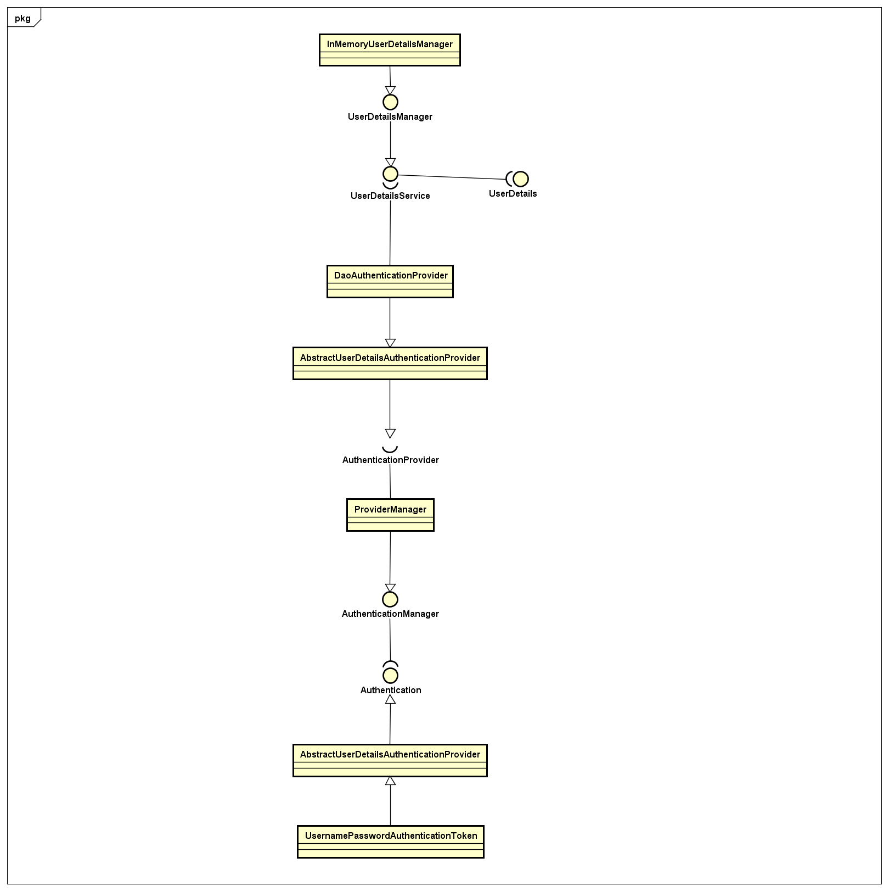
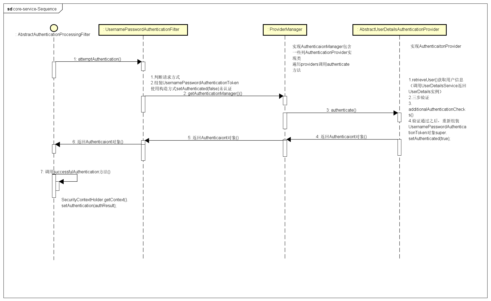
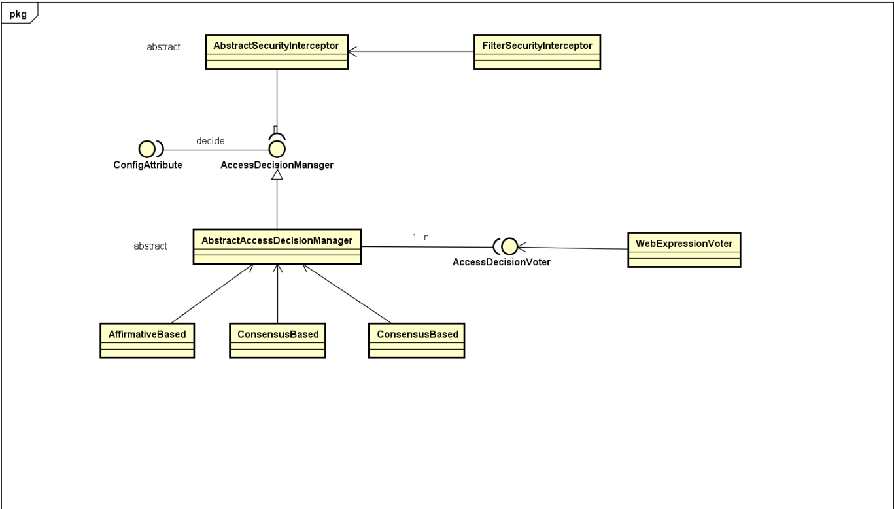
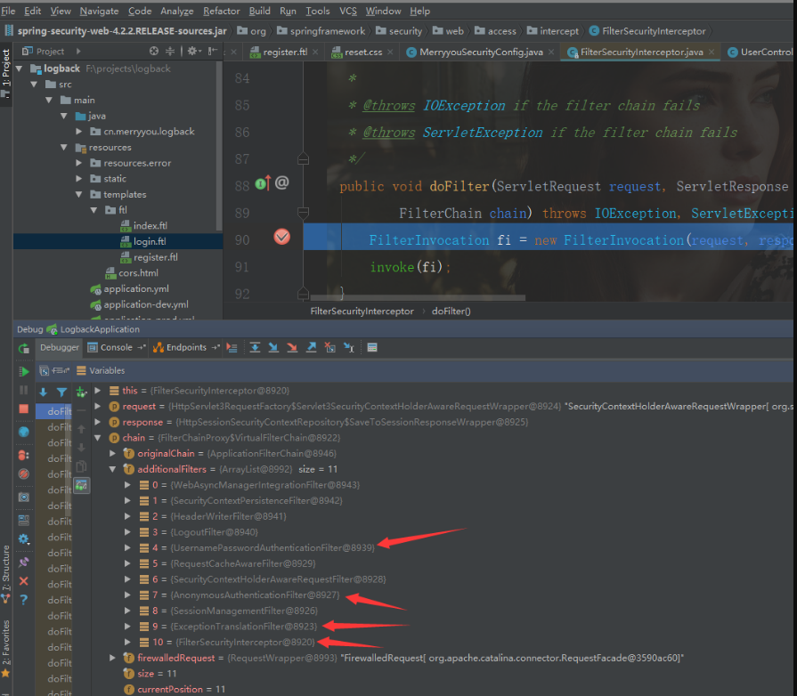
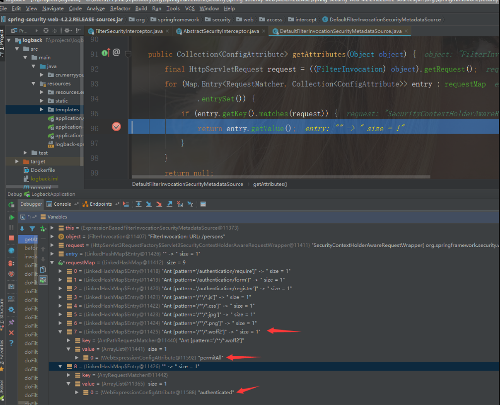
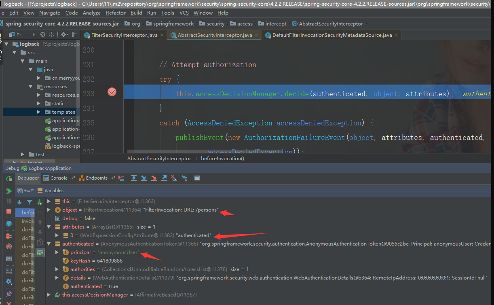
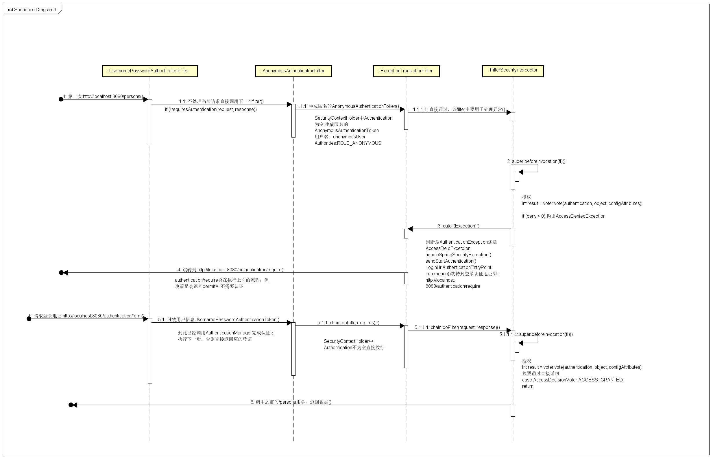

### 参考文档
Spring Security源码分析一：Spring Security认证过程:   
http://niocoder.com/2018/01/02/Spring-Security%E6%BA%90%E7%A0%81%E5%88%86%E6%9E%90%E4%B8%80-Spring-Security%E8%AE%A4%E8%AF%81%E8%BF%87%E7%A8%8B/


### Spring Security认证流程,包含相关的核心认证类 



#### 总结
UserDetailsService接口作为桥梁，是DaoAuthenticationProvier与特定用户信息来源进行解耦的地方， 
UserDetailsService由UserDetails和UserDetailsManager所构成；   
UserDetails和UserDetailsManager各司其责，一个是对基本用户信息进行封装，一个是对基本用户信息进行管理；   

特别注意，UserDetailsService、UserDetails以及UserDetailsManager都是可被用户自定义的扩展点，   
我们可以继承这些接口提供自己的读取用户来源和管理用户的方法，比如我们可以自己实现一个 与特定 ORM 框架，  
比如 Mybatis 或者 Hibernate，相关的UserDetailsService和UserDetailsManager；   

#### 用户认证流程时序图




### 参考文档
Spring Security源码分析二：Spring Security授权过程：   
http://niocoder.com/2018/01/05/Spring-Security%E6%BA%90%E7%A0%81%E5%88%86%E6%9E%90%E4%BA%8C-Spring-Security%E6%8E%88%E6%9D%83%E8%BF%87%E7%A8%8B/#%E6%BA%90%E7%A0%81%E5%88%86%E6%9E%90

### Spring Security用户名密码登录授权是如何实现的




### 调程过程 
1. 调试过程使用 debug方式启动https://github.com/longfeizheng/logback该项目，
2. 浏览器输入http://localhost:8080/persons,用户名随意，密码123456即可；

### 比较重要的 Filter :  



UsernamePasswordAuthenticationFilter，AnonymousAuthenticationFilter，
ExceptionTranslationFilter，FilterSecurityInterceptor    

    
### UsernamePasswordAuthenticationFilter

整个调用流程是，先调用其父类 AbstractAuthenticationProcessingFilter.doFilter() 方法，
然后再执行 UsernamePasswordAuthenticationFilter.attemptAuthentication() 方法进行验证；

### AbstractAuthenticationProcessingFilter

整个程序的执行流程如下:    
1. 判断filter是否可以处理当前的请求，如果不可以则放行交给下一个filter
2. 调用抽象方法attemptAuthentication进行验证，该方法由子类UsernamePasswordAuthenticationFilter实现
3. 认证成功以后，回调一些与 session 相关的方法；
4. 认证成功以后，认证成功后的相关回调方法； 

> 1. 将当前认证成功的 Authentication 放置到 SecurityContextHolder 中；
> 2. 调用其它可扩展的 handlers 继续处理该认证成功以后的回调事件；（实现AuthenticationSuccessHandler接口即可）

### UsernamePasswordAuthenticationFilter
1. 认证请求的方法必须为POST
2. 从request中获取 username 和 password
3. 封装 Authenticaiton 的实现类 UsernamePasswordAuthenticationToken，
  （UsernamePasswordAuthenticationToken调用两个参数的构造方法setAuthenticated(false)）
4. 调用 AuthenticationManager 的 authenticate 方法进行验证；可参考ProviderManager部分；


### AnonymousAuthenticationFilter

AnonymousAuthenticationFilter 过滤器是在 UsernamePasswordAuthenticationFilter 等过滤器之后，
如果它前面的过滤器都没有认证成功，Spring Security 则为当前的 SecurityContextHolder 中添加一个 Authenticaiton 的匿名实现 

1. 判断 SecurityContextHolder 中 Authentication 为否为空；
2. 如果空则为当前的 SecurityContextHolder 中添加一个匿名的 AnonymousAuthenticationToken
（用户名为 anonymousUser 的 AnonymousAuthenticationToken）     


### ExceptionTranslationFilter

ExceptionTranslationFilter 异常处理过滤器,
**该过滤器用来处理在系统认证授权过程中抛出的异常**（也就是下一个过滤器 FilterSecurityInterceptor）,   
**主要是 处理 AuthenticationException 和 AccessDeniedException**。

  
### FilterSecurityInterceptor

此过滤器为认证授权过滤器链中最后一个过滤器   

```
public void doFilter(ServletRequest request, ServletResponse response,
			FilterChain chain) throws IOException, ServletException {
		FilterInvocation fi = new FilterInvocation(request, response, chain);
		invoke(fi);
	}

public void invoke(FilterInvocation fi) throws IOException, ServletException {
		if ((fi.getRequest() != null)
				&& (fi.getRequest().getAttribute(FILTER_APPLIED) != null)
				&& observeOncePerRequest) {
			// filter already applied to this request and user wants us to observe
			// once-per-request handling, so don't re-do security checking
			fi.getChain().doFilter(fi.getRequest(), fi.getResponse());
		}
		else {
			// first time this request being called, so perform security checking
			if (fi.getRequest() != null) {
				fi.getRequest().setAttribute(FILTER_APPLIED, Boolean.TRUE);
			}
			#1. before invocation重要 该过程中会调用 AccessDecisionManager 来验证当前已认证成功的用户是否有权限访问该资源；
			InterceptorStatusToken token = super.beforeInvocation(fi);

			try {
				#2. 可以理解开始请求真正的 服务
				fi.getChain().doFilter(fi.getRequest(), fi.getResponse());
			}
			finally {
				super.finallyInvocation(token);
			}
			#3. after Invocation
			super.afterInvocation(token, null);
		}
	}
```  

1. before invocation重要
2. 请求真正的  服务
3. after Invocation
三个部分中，最重要的是 #1，该过程中会调用 AccessDecisionManager 来验证当前已认证成功的用户是否有权限访问该资源    


### before invocation: AccessDecisionManager    
```
protected InterceptorStatusToken beforeInvocation(Object object) {
		...

		Collection<ConfigAttribute> attributes = this.obtainSecurityMetadataSource()
				.getAttributes(object);

		...
		Authentication authenticated = authenticateIfRequired();

		// Attempt authorization
		try {
			#1.重点
			this.accessDecisionManager.decide(authenticated, object, attributes);
		}
		catch (AccessDeniedException accessDeniedException) {
			publishEvent(new AuthorizationFailureEvent(object, attributes, authenticated,accessDeniedException));

			throw accessDeniedException;
		}

		...
	}
```

authenticated 就是当前认证的 Authentication，那么 object 和 attributes 又是什么呢？  

### attributes 和 object 是什么？
```
Collection<ConfigAttribute> attributes = this.obtainSecurityMetadataSource()
				.getAttributes(object);
```



我们发现object为当前请求的 url:/persons, 那么 getAttributes 方法就是使用当前的访问资源路径去匹配我们自己定义的匹配规则。

```
protected void configure(HttpSecurity http) throws Exception {
        http.formLogin()//使用表单登录，不再使用默认httpBasic方式
                .loginPage(SecurityConstants.DEFAULT_UNAUTHENTICATION_URL)//如果请求的URL需要认证则跳转的URL
                .loginProcessingUrl(SecurityConstants.DEFAULT_SIGN_IN_PROCESSING_URL_FORM)//处理表单中自定义的登录URL
                .and()
                .authorizeRequests().antMatchers(SecurityConstants.DEFAULT_UNAUTHENTICATION_URL,
                SecurityConstants.DEFAULT_SIGN_IN_PROCESSING_URL_FORM,
                SecurityConstants.DEFAULT_REGISTER_URL,
                "/**/*.js",
                "/**/*.css",
                "/**/*.jpg",
                "/**/*.png",
                "/**/*.woff2")
                .permitAll()//以上的请求都不需要认证
                .anyRequest()//剩下的请求
                .authenticated()//都需要认证
                .and()
                .csrf().disable()//关闭csrd拦截
        ;
    }
```

0-7返回 permitALL即不需要认证 ,8对应anyRequest返回 authenticated即当前请求需要认证;



可以看到当前的 authenticated 为匿名 AnonymousAuthentication用户名为 anonymousUser

### AccessDecisionManager 是如何授权的？

Spring Security默认使用 AffirmativeBased 实现 AccessDecisionManager  的 decide 方法来实现授权   

```
public void decide(Authentication authentication, Object object,
			Collection<ConfigAttribute> configAttributes) throws AccessDeniedException {
		int deny = 0;
		#1.调用AccessDecisionVoter 进行vote(投票)
		for (AccessDecisionVoter voter : getDecisionVoters()) {
			int result = voter.vote(authentication, object, configAttributes);

			if (logger.isDebugEnabled()) {
				logger.debug("Voter: " + voter + ", returned: " + result);
			}

			switch (result) {
			#1.1只要有voter投票为ACCESS_GRANTED，则通过 直接返回
			case AccessDecisionVoter.ACCESS_GRANTED://1
				return;
			@#1.2只要有voter投票为ACCESS_DENIED，则记录一下
			case AccessDecisionVoter.ACCESS_DENIED://-1
				deny++;

				break;

			default:
				break;
			}
		}

		if (deny > 0) {
		#2.如果有两个及以上AccessDecisionVoter(姑且称之为投票者吧)都投ACCESS_DENIED，则直接就不通过了
			throw new AccessDeniedException(messages.getMessage(
					"AbstractAccessDecisionManager.accessDenied", "Access is denied"));
		}

		// To get this far, every AccessDecisionVoter abstained
		checkAllowIfAllAbstainDecisions();
	}
```

1. 调用 AccessDecisionVoter 进行vote(投票)
2. 只要有投通过（ACCESS_GRANTED）票，则直接判为通过。
3. 如果没有投通过则 deny++ ,最后判断if（deny>0 抛出 AccessDeniedException（未授权）

### WebExpressionVoter.vote()
```
public int vote(Authentication authentication, FilterInvocation fi,
			Collection<ConfigAttribute> attributes) {
		assert authentication != null;
		assert fi != null;
		assert attributes != null;

		WebExpressionConfigAttribute weca = findConfigAttribute(attributes);

		if (weca == null) {
			return ACCESS_ABSTAIN;
		}

		EvaluationContext ctx = expressionHandler.createEvaluationContext(authentication,
				fi);
		ctx = weca.postProcess(ctx, fi);

		return ExpressionUtils.evaluateAsBoolean(weca.getAuthorizeExpression(), ctx) ? ACCESS_GRANTED
				: ACCESS_DENIED;
	}
```

到此位置 authentication 当前用户信息， fl当前访问的资源路径及 attributes当前资源路径的决策（即是否需要认证）。
剩下就是判断当前用户的角色 Authentication.authorites 是否有权限访问 当前资源fi。

### 授权时序图




